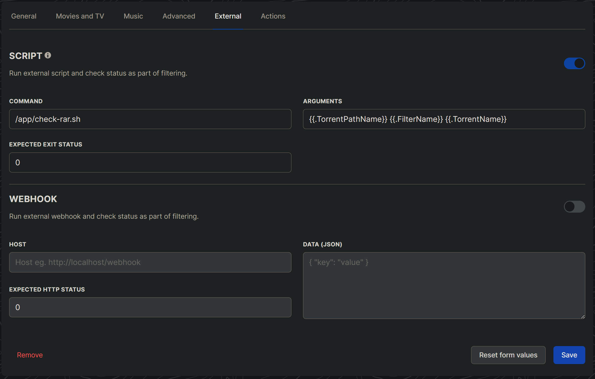

# autobrr-no-rars
This is a simple container that takes the latest [autobrr](https://github.com/autobrr/autobrr) release, adds a binary to inspect torrent metadata, and adds a script that uses that binary to check if any torrent files from a filter contain files within that end in `.rar`.

If you don't like getting stuff from autobrr that has `.rar` files, you're in luck.

## Setup
To ensure that no releases are passed to an action if they contain a `.rar` file, go to the "External" tab of your filter(s). Fill out the following information in the "Script" section of the page:

1. Command: `/app/check-rar.sh`
2. Arguments: `"{{.TorrentPathName}}" "{{.FilterName}}" "{{.TorrentName}}"`
3. Expected exit status: `0`

Then hit save. Here's how it should look:



## Explanation

I got tired of autobrr downloading stuff that has `.rar` files. You have to either extract the `.rar`, which wastes space if you normally use hardlinks to your media folder from your torrent client's download folder (like with Sonarr/Plex), or you could use something like [rar2fs](https://github.com/hasse69/rar2fs) and try to automate that - both of which are equally unappealing. In autobrr, you can theoretically use tags from whatever indexer you're using to limit what you grab, but most IRC announce channels don't send much data other than the name of the torrent and how to get it. I asked for help with this and the only response I got was to manually blacklist release groups that drop rar'd releases, which sounds like a tedious game of whack-a-mole that I would prefer not to play. I wanted a solution that was agnostic of as much as possible, meaning that it would work on any indexer, release group, download client, etc. All I care about is that I don't get rar'd releases.

All my homies hate rar'd releases.

## How it works
This container does two things: downloads a binary of [intermodal](https://github.com/casey/intermodal), which lets us view metadata about torrent files, and it also copies in the validator script. The script uses that `intermodal` binary to dump some JSON metadata about the torrent file that we're evaluating. The script scans the "files" array of that metadata JSON for anything ending in `.rar`. It exits silently if none are found but spits out a log if it does find anything.

## Logging
We pass the `{{.FilterName}}` and the `{{.TorrentName}}` variables as arguments to help identify which release was blocked and what filter it came from. An example log output might be:
```
{
  "level": "debug",
  "module": "filter-rar-script",
  "time": "2023-06-25T19:10:04-02:00",
  "message": "Found rars in a release, ignoring it.",
  "filter": "<my filter name>",
  "torrentName": "<some.torrent.release>",
  "rarFiles": [
    "<file1.rar>",
    "<file2.rar>",
    "<file3.rar>"
  ]
}
```
